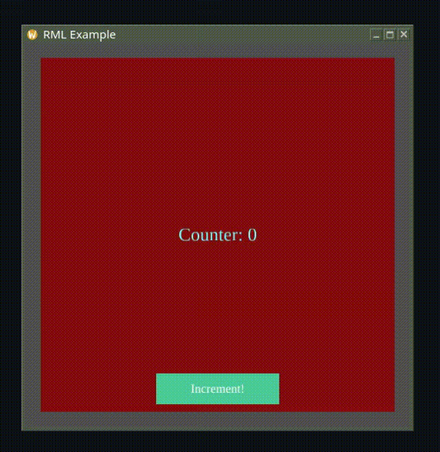

# RML – Rustic Markup Language
A lightweight QML-like toolkit written in Rust

## Version
0.1.1

## About
RML is a simple DSL for creating 2D GUIs in Rust.
It rely on macroquad for rendering and input handling.
The DSL is computed by a not so complicated macro in an Arena Tree at build time before being rendered at runtime.
The DSL don't have scripting capabilities, instead it allow to use Rust code in callbacks and functions.
The arena node access is made with engine calls or with sugar $ notation.
I hope to simplify things a bit and make it more readable in the futur.

This project is a small playground to experiment with ideas and learn.
Not intended for production use — just have fun!

## Example
```rust

use rml_core::prelude::*;
use rml_macros::rml;

fn window_conf() -> Conf {
    Conf {
        window_title: "RML Example".to_owned(),
        window_width: 500,
        window_height: 500,
        window_resizable: true,
        fullscreen: false,
        platform: miniquad::conf::Platform {
            linux_backend: miniquad::conf::LinuxBackend::WaylandOnly,
            ..Default::default()
        },
        ..Default::default()
    }
}

#[macroquad::main(window_conf)]
async fn main() {

    let mut engine = rml!(
        // Importing components from the components folder with an alias access
        import "components" as UI

        Node {
            // Id, anchors, margins are special properties, internaly thez are string type
            id: root
            anchors: fill
            
            // Color properties expect a Color return type
            color color: { DARKGRAY } // color properties expect a Color return type

            // A simple counter stored in the root node it's a typed property
            number counter: 0

            // A custom signal that can be emitted, internally it's a boolean property
            signal clicked

            // The callback, block initializer and functions are all in plain Rust syntax
            // with the addition of the dollar syntax `$` to access nodes and properties
            // more easily, it is also possible to use the full API via the `engine` variable
            on_clicked: {
                // When the signal fires, increment the counter
                $.root.counter = $.root.counter + 1.0; // numbers are f32
                $.label.text = format!("Counter: {}", $.root.counter);
            }

            // A function used inside UI properties
            fn compute_font_size() -> u32 {
                // Dynamic but constant here—just to demonstrate usage
                18 + 6
            }

            // Background panel
            Rectangle {
                id: background_panel
                anchors: fill
                margins: 20
                color color: {
                    // color shifts slightly as counter increases
                    Color::new(0.52, 0.0, ($.root.counter/20.0).min(1.0), 1.0)
                }
            }

            // Text label
            Text {
                id: label
                anchors: center
                // Text property is typed as string
                string text: { format!("Counter: {}", $.root.counter) }
                // Font is not typed as string
                font: "liberation"

                // But they are string properties anyway.
                // It's important to type the properties if they will be used somewhere with the dollar sugar syntax
                // in other case, the engine will just use the property as needed without type checking.
                // Because internally, properties are stored as AbstractValue enum, and can be retyped at runtime.
                
                color color: { invert_color($.background_panel.color, 1.0) }
                number font_size: { compute_font_size() } // <= will generate a callback and an initialiser
                // if a property binding is detected in the callback, it is binded and re-evaluated when the property changes
            }

            // Button
            UI::Button {
                anchors: center | bottom
                margins: 30
                text: "Increment!"
                font: "liberation"

                on_click: {
                    // Emit a signal handled by the root node
                    emit!(engine, root, clicked);
                }
            }
        }
    );

    // We add a font to use in the RML
    let font = load_ttf_font("./LiberationSerif-Regular.ttf")
        .await
        .unwrap();
    engine.add_font("liberation".to_string(), font);

    loop {
        engine.process_events();
        clear_background(BLACK);
        rml_core::draw::draw_root(&mut engine);
        next_frame().await
    }
}

```

## Result example  (main example)


## Current Status: Unstable
This project is under active experimentation.
The parts listed below barely works for some.
⚠️ Code may be incomplete, buggy, or broken — use at your own risk!

## Current Features

* Simple DSL with Rectangle, Text, MouseArea nodes ✅

* Supports property types: Number, Bool, String, Vec ✅

* Core engine for node arena, event system, properties, and callbacks ✅

* Callbacks, functions (can accept engine context but no return value), and initial values can be defined in Rust directly in the DSL ✅

* Basic anchor system ✅

* Rendering with macroquad ✅

* Lightweight and easy to extend ✅

* Add on_ready event and compute bindings in property initialization ✅

* System events: Keyboard & mouse input & window events ✅

* Load multiple files (e.g., external components) ✅

* Optional scoped IDs: isolate ID usage per file (limited to root node of a file) ✅

* Custom event definitions ✅

* Implement rapid setter / getter $ macro ( $.draggable.x = new_x; ) there is some limitations but it's a start ✅

* Rework the rapid access syntax to get rid of the need for the $ and :f32 :string etc syntax ✅

* Adding optionnal typing for properties, used to handle the $ syntax but may be forced in futur ✅

* Better functions declaration (ability to return values) ✅

* Better text node (with font support) ✅

## Planned Features / TODO (order by interest)

* Extend import logic (multiple imports per file, global import at root node)

* Add an Image node type

* Add tests

* Layout & positioning:
    * Layout system
    * Positioning items: Column, Row, Grid; compatible with anchors and the layout system

* Data models:
    * ListModel, TableModel via declarative Rust macros
    * Support for field access, sorting, and filtering
    * This will certainly need a way to access the data in the engine context

* Rename to CML (Cute Markup Language) or RTML (Rustic Markup Language - Rust Toy Markup Language - Real Tiny Markup Language ? Real Time Markup Language ??)
I'm considering renaming it to CML (Cute Markup Language) or RTML - a more playful alternative to RML, which could be misinterpreted as Rust Markup Language.
Obviously, build by myself and alone an ui lib that can be called RML and that will be used by all end every rust project as the defacto standard has always be my goal but... well it's pretty hard
Anyway, I'm lazy to rename it now. I will keep it like that until I get a better name and the motivation to change it.
That being said, I'm open to feedback; if you disagree with the name, feel free to open an issue and we can discuss it. For now, the project is small, so it's not a top priority.

## License

Licensed under the MIT License.
Feel free to use, modify, and play around!
