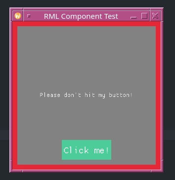

# RML – Rustic Markup Language
A lightweight QML-like toolkit written in Rust

## Why?
This project is a small playground to experiment with ideas and learn.
Not intended for production use — just have fun!

## Example
```rust
let mut engine = rml!(
        import "components" as UI

        Node {
            id: root
            width: 200
            height: 200
            text: "Please don't hit my button!"

            signal click

            on_click: {
                $.root.text = "outch!".to_string();
            }
            
            Text {
                anchors: center
                text: { $.root.text }
                color: { WHITE }
                font_size: 16
            }

            UI::Button {
                id: test_btn
                anchors: center | bottom
                text: "Click me!"
                color: { BLACK }
                on_click: {
                    emit!(engine, root, click);
                }
            }
        }
    );
```

## Result example  (main example)


## Current Status: Unstable
This project is under active experimentation.
The parts listed below barely works for some.
⚠️ Code may be incomplete, buggy, or broken — use at your own risk!

## Current Features

* Simple DSL with Rectangle, Text, MouseArea nodes ✅

* Supports property types: Number, Bool, String, Vec ✅

* Core engine for node arena, event system, properties, and callbacks ✅

* Callbacks, functions (can accept engine contexte but no return value), and initial values can be defined in Rust directly in the DSL ✅

* Basic anchor system ✅

* Rendering with macroquad ✅

* Lightweight and easy to extend ✅

* Add on_ready event and compute bindings in property initialization ✅

* System events: Keyboard & mouse input & window events ✅

* Load multiple files (e.g., external components) ✅

* Optional scoped IDs: isolate ID usage per file (limited to root node of a file) ✅

* Custom event definitions ✅

* Implement rapid setter / getter $ macro ( $.draggable.x = new_x; ) there is some limitations but it's a start ✅

## Planned Features / TODO (order by interest)

* Better functions declaration (ability to return values)

* Rework the rapid access syntax to get rid of the need for the $ macro and :f32 :string etc syntax

* Add an Image node type

* Add tests

* Layout & positioning:
    * Layout system
    * Positioning items: Column, Row, Grid; compatible with anchors and the layout system

* Data models:
    * ListModel, TableModel via declarative Rust macros
    * Support for field access, sorting, and filtering

* Resource system:
    * Declare and include assets (e.g., images, fonts) from a folder
    * Bundle with executable

* Rename to CML (Cute Markup Language) or RTML (Rustic Markup Language - Rust Toy Markup Language - Real Tiny Markup Language ? Real Time Markup Language ??)
I'm considering renaming it to CML (Cute Markup Language) or RTML - a more playful alternative to RML, which could be misinterpreted as Rust Markup Language.
Obviously, build by myself and alone an ui lib that can be called RML and that will be used by all end every rust project as the defacto standard has always be my goal but... well it's pretty hard
Anyway, I'm lazy to rename it now. I will keep it like that until I get a better name and the motivation to change it.
That being said, I'm open to feedback; if you disagree with the name, feel free to open an issue and we can discuss it. For now, the project is small, so it's not a top priority.

## License

Licensed under the MIT License.
Feel free to use, modify, and play around!