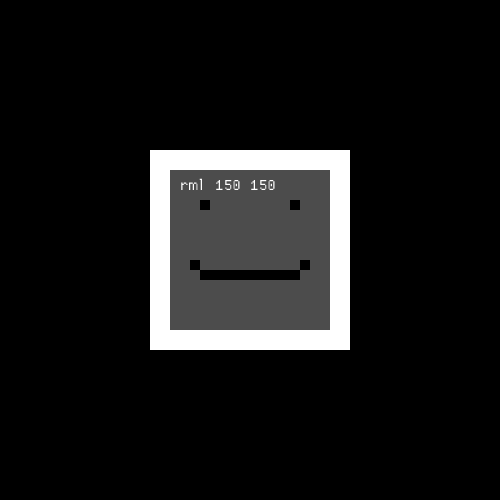

# RML – Rustic Markup Language
A lightweight QML-like toolkit written in Rust

## Why?
This project is a small playground to experiment with ideas and learn.
Not intended for production use — just have fun!

## Example
```rust
let mut engine = rml!(
    Node {
        id: root
        width: 500.0
        height: 500.0

        // A rectangle anchored to fill the root node
        Rectangle {
            width: 10
            height: 10
            anchors: fill
            color: "rgba(1.0, 0.0, 0.0, 0.3)"
        }

        // Same, but with margins
        Rectangle {
            width: 10
            height: 10
            anchors: fill
            margins: 50
            color: "rgba(0.0, 1.0, 0.0, 0.3)"
        }

        // Top-left corner
        Rectangle {
            width: 10
            height: 10
            anchors: top | left
            color: "rgba(0.0, 1.0, 0.0, 1.0)"
        }

        // Top-right corner
        Rectangle {
            width: 10
            height: 10
            anchors: top | right
            color: "rgba(0.0, 0.0, 1.0, 1.0)"
        }

        // Bottom bar
        Rectangle {
            anchors: left | right | bottom
            bottom_margin: 10
            width: 10
            height: 10
            color: "rgba(1.0, 0.0, 0.0, 1.0)"
        }
    }
);
```

## Result


## Current Status: Unstable
This project is under active experimentation.
⚠️ Code may be incomplete, buggy, or broken — use at your own risk!

## Current Features

* ✅ Simple DSL with Rectangle and Text nodes

* ✅ Supports property types: Number, Bool, String, Vec

* ✅ Core engine for node arena, event system, properties, and callbacks

* ✅ Callbacks, functions, and initial values can be defined in Rust directly in the DSL

* ✅ Basic anchor system

* ✅ Rendering with macroquad

* ✅ Lightweight and easy to extend

## Planned Features / TODO

* Rename to CML (Cute Markup Language) — a more playful alternative to RML

* Load multiple files (e.g., external components)

* System events:

    * Keyboard & mouse input

    * Window events

    * Custom event definitions

* Resource system:

    * Declare and include assets (e.g., images, fonts) from a folder

    * Bundle with executable

* Optional scoped IDs: isolate ID usage per file

* Layout & positioning:

    * Positioning items: Column, Row, Grid

    * Fully compatible with anchors and the layout system

* Data models:

    * ListModel, TableModel via declarative Rust macros

    * Support for field access, sorting, and filtering

## License

Licensed under the MIT License.
Feel free to use, modify, and play around!