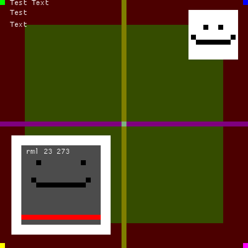

# RML – Rustic Markup Language
A lightweight QML-like toolkit written in Rust

## Why?
This project is a small playground to experiment with ideas and learn.
Not intended for production use — just have fun!

## Example
```rust
let mut engine = rml!(
    Rectangle {
        id: root_btn_template
        width: 100
        height: 40
        text: "Button"
        base_color: { Color::new(0.3, 0.8, 0.6, 1.0) }
        hovered: false
        pushed: false

        color: {
            let mut color = $.root_btn_template.base_color:color;
            if $.root_btn_template.pushed:bool { darker_color(color, 0.1) }
            else if $.root_btn_template.hovered:bool { lighter_color(color, 0.1) }
            else { color }
        }

        signal click
        
        Text {
            anchors: center
            text: { $.root_btn_template.text }
            color: { WHITE }
            font_size: 16
        }
        
        MouseArea {
            anchors: fill
            on_click: { emit!(engine, root_btn_template, click); }
            on_mouse_down: { $.root_btn_template.pushed = true; }
            on_mouse_up: { $.root_btn_template.pushed = false; }
            on_mouse_enter: { $.root_btn_template.hovered = true; }
            on_mouse_leave: { $.root_btn_template.hovered = false; }
        }
    }
);
```

## Result example  (main example)


## Current Status: Unstable
This project is under active experimentation.
⚠️ Code may be incomplete, buggy, or broken — use at your own risk!

## Current Features

* Simple DSL with Rectangle, Text, MouseArea nodes ✅

* Supports property types: Number, Bool, String, Vec ✅

* Core engine for node arena, event system, properties, and callbacks ✅

* Callbacks, functions, and initial values can be defined in Rust directly in the DSL ✅

* Basic anchor system ✅

* Rendering with macroquad ✅

* Lightweight and easy to extend ✅

* Add on_ready event and compute bindings in property initialization ✅

* System events: Keyboard & mouse input & window events ✅

* Load multiple files (e.g., external components) ✅

* Optional scoped IDs: isolate ID usage per file (limited to root node of a file) ✅

* Custom event definitions ✅

* Implement rapid setter / getter $ macro ( $.draggable.x = new_x; ) there is some limitations but it's nice ✅

## Planned Features / TODO (order by interest)

* Add an Image node type

* Add tests

* Layout & positioning:
    * Layout system
    * Positioning items: Column, Row, Grid; compatible with anchors and the layout system

* Data models:
    * ListModel, TableModel via declarative Rust macros
    * Support for field access, sorting, and filtering

* Resource system:
    * Declare and include assets (e.g., images, fonts) from a folder
    * Bundle with executable

* Rename to CML (Cute Markup Language)
I'm considering renaming it to CML (Cute Markup Language) - a more playful alternative to RML, which could be misinterpreted as Rust Markup Language. However, I'm attached to the RML name, as it makes sense for a rustic, Rust-based project inspired by QML. That being said, I'm open to feedback; if you disagree with the name, feel free to open an issue and we can discuss it. For now, the project is small, so it's not a top priority."

## License

Licensed under the MIT License.
Feel free to use, modify, and play around!